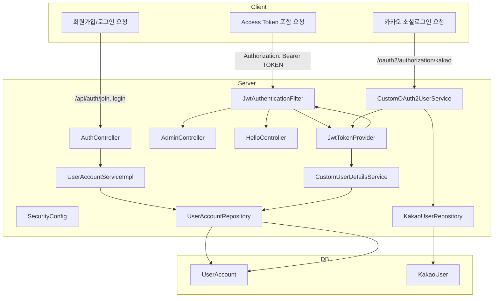
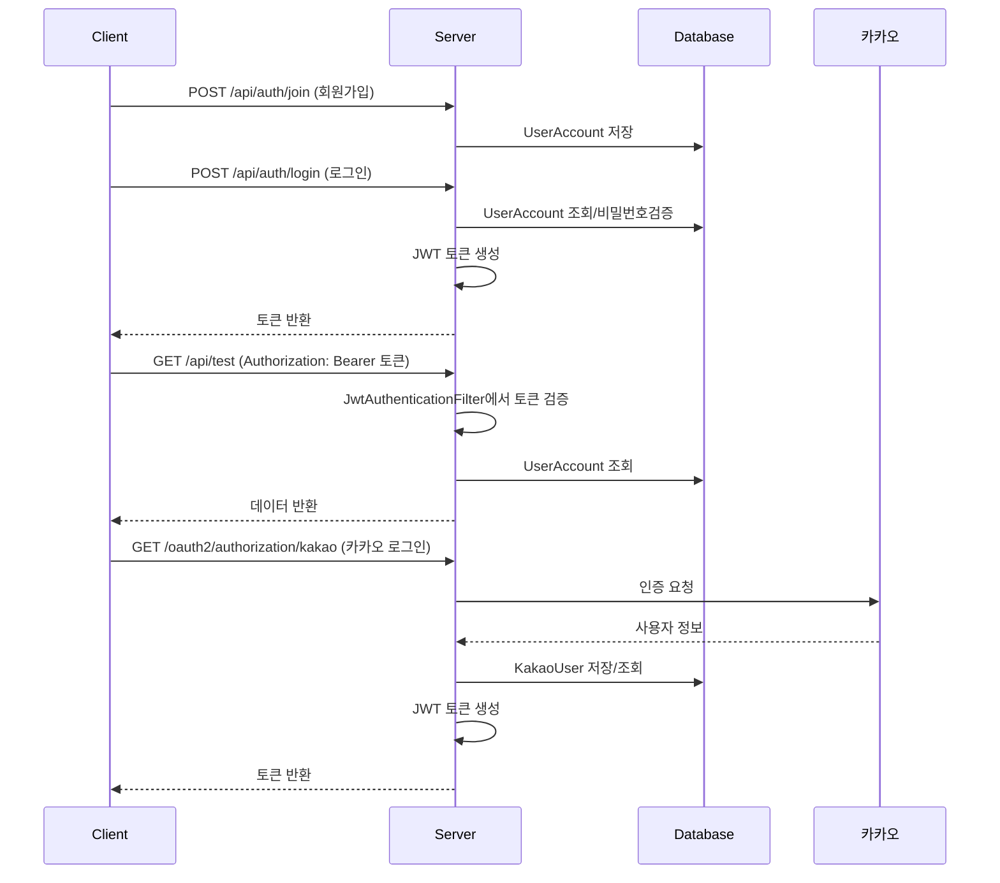

# 1. 전체 구조 \& 흐름 요약 (mermaid 시각화)

먼저, 전체 인증 흐름과 주요 컴포넌트 관계를 시각화합니다.




---

# 2. 파일별 기능 및 역할 요약

## 2-1. 인증/보안 관련

### JwtAuthenticationFilter

- HTTP 요청에서 JWT 토큰을 추출해 인증하는 **Spring Security 커스텀 필터**
- 유효한 토큰이면 SecurityContext에 인증 정보 저장


### JwtTokenProvider

- JWT 토큰 **생성/검증/정보추출** 등 JWT 관련 핵심 로직 담당 클래스


### SecurityConfig

- **Spring Security 전체 설정**: 필터, 인증방식, 권한, OAuth2, 패스워드 인코더 등

---

## 2-2. 컨트롤러

### AuthController

- 회원가입, 로그인 등 인증 관련 API


### AdminController

- `/api/admin` 어드민 전용 API


### HelloController

- `/api/test` 테스트 및 JWT 인증 예시 API

---

## 2-3. 엔티티

### UserAccount

- 일반 회원 정보 (username, password, role 등)


### KakaoUser

- 카카오 소셜 로그인 회원 정보

---

## 2-4. 서비스

### CustomUserDetailsService

- DB에서 회원 정보 조회 후 UserDetails로 변환 (Spring Security 인증용)


### CustomOAuth2UserService

- 소셜 로그인(카카오) 사용자 정보 처리 및 저장


### UserAccountServiceImpl

- 회원가입, 로그인 등 실제 비즈니스 로직 구현

---

## 2-5. 설정 및 빌드

- application.yml: DB, JWT, OAuth2 등 환경설정
- build.gradle: 의존성 및 빌드 설정

---

# 3. 실무 개발 순서에 따른 리뷰

## 3-1. 엔티티/DB 설계

### UserAccount, KakaoUser

- UserAccount: 일반 회원(PK: UUID, username, password, role, createdAt)
- KakaoUser: 카카오 회원(PK: UUID, username, name)
- 실무 팁: username은 unique, password는 암호화 저장

---

## 3-2. 서비스/비즈니스 로직 구현

- CustomUserDetailsService: username으로 DB에서 회원 조회, UserDetails 반환
- UserAccountServiceImpl: 회원가입/로그인/어드민가입, 비밀번호 암호화, JWT 발급
- CustomOAuth2UserService: 카카오 로그인 성공 시 사용자 정보 추출/저장

---

## 3-3. JWT 관련 클래스 구현

- JwtTokenProvider: JWT 생성/검증/정보추출
- JwtAuthenticationFilter: 모든 요청에서 JWT 추출 및 인증

---

## 3-4. Spring Security 설정

- SecurityConfig: CSRF, 세션정책, 경로별 권한, JWT 필터, OAuth2 로그인, 인증매니저 등 설정

---

## 3-5. 컨트롤러 작성 및 API 테스트

- AuthController: 회원가입/로그인 API
- HelloController/AdminController: JWT 인증 필요 API

---

# 4. 파일별 상세 리뷰 (문법/동작/실무 관점)


---

## 4-1. JwtAuthenticationFilter

### 주요 기능

- HTTP 요청마다 Authorization 헤더에서 "Bearer " 토큰 추출
- 토큰 유효성 검사 후 인증정보(SecurityContext)에 저장


### 핵심 문법

```java
String authHeader = req.getHeader("Authorization");
if (authHeader != null && authHeader.startsWith("Bearer ")) {
    String token = authHeader.substring(7);
    if (jwtTokenProvider.validateToken(token)) {
        Authentication auth = jwtTokenProvider.getAuthentication(token);
        SecurityContextHolder.getContext().setAuthentication(auth);
    }
}
chain.doFilter(req, res);
```

- **SecurityContextHolder**: Spring Security의 인증 저장소
- **chain.doFilter**: 다음 필터로 요청 전달

---

## 4-2. JwtTokenProvider

### 주요 기능

- JWT 생성/검증/정보 추출
- 토큰에 username, roles 등 정보 포함


### 주요 메서드

- **generateToken**: 토큰 생성
- **validateToken**: 토큰 유효성 검사
- **getUsername/getRoles**: 토큰에서 정보 추출
- **getAuthentication**: 토큰 정보로 Authentication 객체 생성


### 문법 포인트

- **@Value**: application.yml에서 값 주입
- **Jwts.builder()**: JWT 생성
- **Jwts.parser()**: JWT 파싱 및 검증

---

## 4-3. SecurityConfig

### 주요 기능

- Spring Security 전체 설정
- JWT 필터 등록, 경로별 권한, OAuth2 로그인, 패스워드 인코더 등


### 문법 포인트

- **@Configuration, @EnableWebSecurity**: Spring Security 설정 클래스
- **.csrf().disable()**: REST API에서 CSRF 비활성화
- **.sessionManagement().sessionCreationPolicy(STATELESS)**: 세션 미사용
- **.addFilterBefore(jwtFilter(), UsernamePasswordAuthenticationFilter.class)**: JWT 필터 등록

---

## 4-4. AuthController

### 주요 기능

- 회원가입, 로그인, 어드민 가입 API
- 예외처리(잘못된 요청, 유저 없음 등)


### 문법 포인트

- **@RestController, @RequestMapping**: REST API 컨트롤러
- **@PostMapping**: POST 요청 처리
- **@ExceptionHandler**: 예외 발생시 응답 제어

---

## 4-5. AdminController, HelloController

### 주요 기능

- JWT 인증 필요 API 예시
- Swagger 문서화용 어노테이션 사용


### 문법 포인트

- **@SecurityScheme, @SecurityRequirement**: Swagger에서 JWT 인증 명시
- **Authentication 파라미터**: 인증된 사용자 정보 자동 주입

---

## 4-6. UserAccount, KakaoUser (엔티티)

### 주요 기능

- JPA 엔티티, DB 테이블 매핑


### 문법 포인트

- **@Entity, @Id, @GeneratedValue**: JPA 기본 어노테이션
- **@Column(nullable, unique)**: 컬럼 제약조건

---

## 4-7. CustomUserDetailsService

### 주요 기능

- username으로 DB에서 회원 조회, UserDetails 반환


### 문법 포인트

- **UserDetailsService 인터페이스 구현**
- **User.builder()**: Spring Security User 객체 생성

---

## 4-8. CustomOAuth2UserService

### 주요 기능

- 카카오 로그인 성공 시 사용자 정보 추출/DB 저장


### 문법 포인트

- **OAuth2UserService 인터페이스 구현**
- **Map 구조 파싱**: provider별 응답 구조에 맞게 파싱
- **@Service, @RequiredArgsConstructor**: 스프링 빈, 생성자 주입

---

## 4-9. UserAccountServiceImpl

### 주요 기능

- 회원가입, 로그인, 어드민 가입 등 비즈니스 로직
- 비밀번호 암호화, JWT 발급


### 문법 포인트

- **@Service, @RequiredArgsConstructor**
- **PasswordEncoder**: 비밀번호 암호화
- **AuthenticationManager**: 인증 처리

---

## 4-10. application.yml

### 주요 기능

- DB, JPA, JWT, OAuth2 등 환경설정


### 문법 포인트

- **\${변수명}**: 환경변수로 민감 정보 관리
- **spring.security.oauth2.client.registration/provider**: 소셜 로그인 설정

---

## 4-11. build.gradle

### 주요 기능

- 프로젝트 빌드 및 의존성 관리


### 문법 포인트

- **dependencies**: Spring Boot, JPA, Security, OAuth2, JWT, Lombok 등

---

# 5. 전체 동작 흐름 예시 (시퀀스 다이어그램)




---
